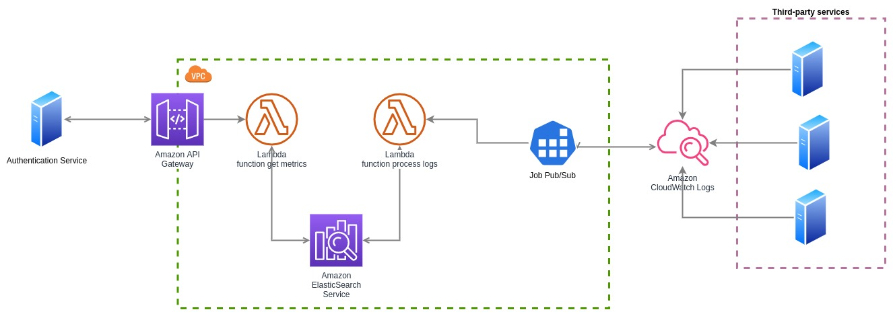

# Metrics Service

Assignment Software Engineer Cloud Services

## Architecture Proposal



The diagram above shows a high-level architecture diagram of how the solution would be delegated. It should be noted that:

- The logs would be stored in an elastic service, to facilitate searches by keyword and other filters, also taking advantage of the fact that there is no need to do too much data formatting.
- The logs would be read from other services through Cloudwatch in order to facilitate the task of synchronizing this data and provide a standard reading interface for the lambda in charge of processing them.
- Both lambdas (get_metrics, process_logs) will have access to the elastic in a transparent way, since everything will be inside a VPC.
- In order to access the metrics, the authentication service will do so through an API Gateway that will be able to communicate the get_metrics service with the outside world.
- Finally, the job will be able to make use of a queue to send the logs to the process_logs service and in this way not to saturate the service due to excess concurrency.

# Services

## Assumptions

- The log file sent will have a standard format, however a 'logs_format' attribute has been provided that allows it to be varied according to the file format. The formats are based on the python parse library (https://pypi.org/project/parse/)

- The search for the metrics is done through keyword search, this means that it is searched according to the parameters provided within the log message and it is assumed that if the search appears it is successful.

- No advanced search was carried out in the text or through regular expressions, since it was assumed that it was outside the scope of the POC.

- The processed data is stored in a CSV file for later uploading and searching on the metrics endpoint.

## Installation

### Dependencies

We are use the `Pipenv` to keep all the dependencies up to date.

- Install pipenv module

```bash
$ apt install pipenv
```

- After that we can create a virtualenv

```bash
$ pipenv shell
```

- Now you can install the 3rd party package you need

```bash
$ pipenv install fastapi
```

- You can specify that this dependency is only for development

```bash
$ pipenv install pytest --dev
```

- Now is time to install all dependencies

```bash
$ pipenv install # This install all dependencies necesaries to the project work
$ pipenv install --dev # This install all dependencies even develop dependencies
```

- To unistall all dependencies use

```bash
$ pipenv uninstall --all
```

- If everything working well in local environment, now we can push it to production. To be ensure we have the same one in production use the `Pipfile.lock`

```bash
$ pipenv lock
```

- Once you get your code and Pipfile.lock in your production environment, you should install the last successful environment recorded

```bash
$ pipenv install --ignore-pipfile
```

## Running

### Run local project

We use `uvicorn` to run service in local

```bash
$ uvicorn --port 8080 --host 0.0.0.0 --timeout-keep-alive 300 app.main:app
```

Hostnames for accessing the service directly

```
http://127.0.0.1:8080
```

See OpenAPI documentation

```
http://127.0.0.1:8080/docs
```

### Docker Run

- Build Docker image

```
docker build -t metrics .
```

- Run Docker Image

```
docker run -p 8080:8080 --network=host metrics
```

## Run test

The library for unit test we are to use is `pytest` this library to allow creating test quickly.

To run the test use the following command in the root directory:

```bash
$ pytest -v
```

To get the coverage run:

```bash
$ pytest --cov-report term-missing --cov=. app/tests/
```
